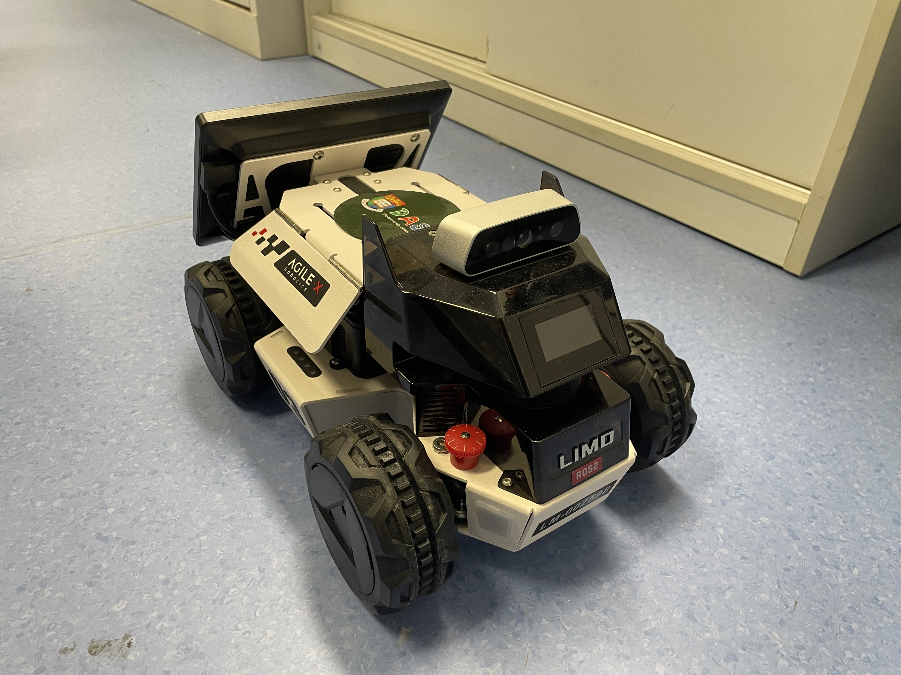
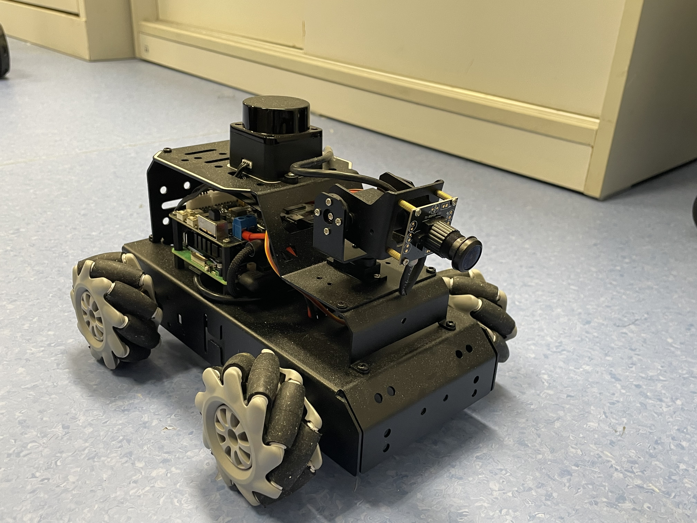
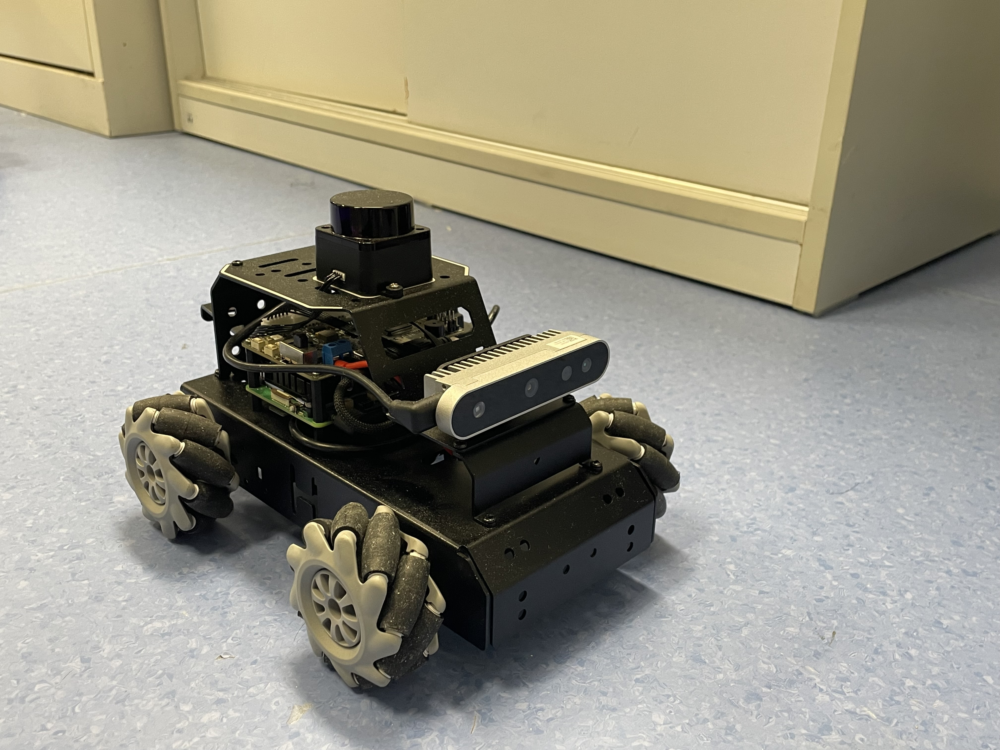

# HKU-SAS ROS platform
The repo contains the basic ROS2 packages for multiple functionalties available for R&D related purposes (this project is funded by UGC Teaching Development Grant)

Project principal investigator: Prof. Chen Sun (c87sun@hku.hk)

Developer: Peter WANG (bugs please contact peterwang.dase@connect.hku.hk/peter.w030522@gmail.com)

UI maintenace: Yiming Shu (yiming.shu@connect.hku.hk)


## Implementation Examples:
Car following trial:

[](https://youtu.be/yJlPozCGnqk)

Lidar following trial (the robot follows the student):

[](https://youtu.be/b306i8XMZHo)

Mapping trial:

[](https://youtu.be/D1kEoad1aVk)

## I. Platform Specifications






### Hardware Specifications
- Nomachine login:
- 
  username: agilex
  
  password: agx
  
- Login ssh/nx: please check directly from the onboard Nomachine
### Car Warmup
- Long press the switch to start (short press to pause the program). Observe the electricity meter, and charge or replace the battery in time when the last red light is on.
- Observe the status of the front latch and the color of the vehicle light to determine the current mode

Start keyboard control:
```bash
ros2 run teleop_twist_keyboard teleop_twist_keyboard
```

## II. MentorPi ROS Program Map for Student Completion Tasks

Source archive checked: `C:/MentorPi/src.zip`

### 1. Mecanum Chassis Speed ​​Control

| Program / file | ROS name | Role |
|---|---|---|
| `src/driver/controller/launch/controller.launch.py` | `ros2 launch controller controller.launch.py` | Main launch for chassis control |
| `src/driver/controller/launch/odom_publisher.launch.py` | included launch | Starts robot description, controller board, and odometry node |
| `src/driver/controller/controller/odom_publisher_node.py` | executable: `odom_publisher` | Subscribes to `controller/cmd_vel`, selects mecanum control, publishes motor speeds |
| `src/driver/controller/controller/mecanum.py` | module: `controller.mecanum` | Converts `linear.x`, `linear.y`, `angular.z` into 4 wheel speeds |
| `src/driver/controller/config/calibrate_params.yaml` | parameter file | Linear/angular correction factors |
| `src/driver/ros_robot_controller/ros_robot_controller/ros_robot_controller_node.py` | executable: `ros_robot_controller` | Sends `MotorsState` commands to the STM32/motor controller |

Good student task targets:
- Complete `MecanumChassis.speed_covert()`
- Complete wheel speed equations in `MecanumChassis.set_velocity()`
- Complete `Controller.cmd_vel_callback()` for `MentorPi_Mecanum`

### 2. Lidar obstacle avoidance

| Program / file | ROS name | Role |
|---|---|---|
| `src/app/launch/lidar_node.launch.py` | `ros2 launch app lidar_node.launch.py debug:=true` | Starts LiDAR app node; optionally starts LiDAR and chassis control |
| `src/app/app/lidar_controller.py` | executable: `lidar_controller`, node: `lidar_app` | Main LiDAR obstacle avoidance/following program |
| `src/peripherals/launch/lidar.launch.py` | included launch | Generic LiDAR launch wrapper |
| `src/peripherals/launch/include/ldlidar_LD19.launch.py` | node: `LD19` | LD19 LiDAR driver launch |
| `src/peripherals/launch/include/sllidar_a1.launch.py` | node: `sllidar_node` | SLLidar A1 driver launch |
| `src/peripherals/launch/include/ydlidar_g4.launch.py` | node: `ydlidar_ros2_driver_node` | YDLidar G4 driver launch |
| `src/interfaces/srv/SetInt64.srv` | service type | Used by `/lidar_app/set_running`; `data: 1` starts obstacle avoidance |
| `src/interfaces/srv/SetFloat64List.srv` | service type | Used by `/lidar_app/set_param` for threshold, scan angle, speed |

student task targets:
- Complete `running_mode == 1` logic in `lidar_callback()`
- Compute `min_dist_left` and `min_dist_right`
- Decide turn/forward behavior based on obstacle distance
- Publish the final `geometry_msgs/Twist` to `/controller/cmd_vel`

### 3. Lidar following

| Program / file | ROS name | Role |
|---|---|---|
| `src/app/launch/lidar_node.launch.py` | `ros2 launch app lidar_node.launch.py debug:=true` | Same launch file as obstacle avoidance |
| `src/app/app/lidar_controller.py` | executable: `lidar_controller`, node: `lidar_app` | `running_mode == 2` implements LiDAR following |
| `src/driver/sdk/sdk/pid.py` | module: `sdk.pid` | PID controller used for yaw and distance control |
| `src/driver/sdk/sdk/common.py` | module: `sdk.common` | Utility functions such as output range limiting |
| `src/interfaces/srv/SetInt64.srv` | service type | `/lidar_app/set_running` with `data: 2` starts following |

student task targets:
- Merge left/right LaserScan ranges
- Find nearest object distance and angle
- Complete PID-based yaw control
- Complete distance control and deadband handling
- Publish `Twist` commands to follow the object

### Likely ROS packages to build

`interfaces`, `ros_robot_controller_msgs`, `sdk`, `ros_robot_controller`, `controller`, `peripherals`, `app`

Suggested build command after extracting into the ROS2 workspace:

```bash
colcon build --packages-select interfaces ros_robot_controller_msgs sdk ros_robot_controller controller peripherals app
```

## III. Function Uses

### Bringup and Interfaces

The chassis driver publishes the standard control / state topics (e.g., `/cmd_vel`, `/imu`, `/tf`, `/wheel/odom`, `/limo_status`). Start it with: 

```bash
ros2 launch limo_base limo_base.launch.py
```

For the standard “robot + LiDAR” bringup used by mapping/navigation launch files:

```bash
ros2 launch limo_bringup limo_start.launch.py
```

## Mapping + Navigation

### A) 2D LiDAR pipeline (Cartographer + Nav2)

**1) Start sensor + base**

```bash
ros2 launch limo_bringup limo_start.launch.py
```

**2) Run Cartographer mapping**

```bash
ros2 launch limo_bringup limo_cartographer.launch.py
```

Drive slowly while mapping; fast motion tends to degrade scan-matching and submap consistency. 

**3) Save the map**

```bash
ros2 run nav2_map_server map_saver_cli -f map
```

This produces `map.yaml` + `map.pgm` (or equivalent) in the current directory. 

**4) Run Nav2 localization + navigation (differential / track / mecanum modes)**

```bash
ros2 launch limo_bringup limo_nav2_diff.launch.py
```

If using Ackermann mode:

```bash
roslaunch limo_bringup limo_nav2_ackermann.launch.py
```

In RViz2, we usually do an initial pose estimate (2D Pose Estimate) if the laser overlay doesn’t align with the map, then send goals with 2D Nav Goal. Multi-goal navigation is supported from the RViz Nav2 panel. 

---

### B) RGB-D visual pipeline (RTAB-Map + Nav2)

This path uses the Dabai RGB-D camera + LiDAR bringup, builds an RTAB-Map database, and then runs Nav2 on top of RTAB localization. 

**1) Start sensor + base**

```bash
ros2 launch limo_bringup limo_start.launch.py
ros2 launch astra_camera dabai.launch.py
```

**2) Mapping (RTAB-Map)**

```bash
ros2 launch limo_bringup limo_rtab_rgbd.launch.py
```

The database is saved as `rtabmap.db` under directory home (often within the hidden `.ros/` directory). 

**3) Localization using the saved DB**

```bash
ros2 launch limo_bringup limo_rtab_rgbd.launch.py localization:=true
```

**4) Navigation**

```bash
ros2 launch limo_bringup limo_rtab_nav2_diff.launch.py
```

Ackermann variant:

```bash
roslaunch limo_bringup limo_rtab_nav2_ackermann.launch.py
```

RTAB-Map localization typically removes the need for manual initial-pose alignment; We usually start sending Nav2 goals directly once localization is stable. 

## Student ROS Submission Pipeline

### Summary
Use a school-hosted backend runner, not GitHub Actions as the main path. Students upload only the assigned task files from the HTML website. The backend inserts those files into a locked instructor ROS2 workspace template, runs `colcon build` and tests inside a Docker ROS2 environment, then returns build/test results to the website. GitHub can remain optional for instructor templates or advanced students, but it should not be required for normal classroom submission.

### Key Logic
- Website flow: student selects lesson task, uploads completed file, submits, then watches status: `queued -> building -> testing -> passed/failed`.
- Backend flow: create isolated job workspace, copy instructor template, replace only allowed files, run validation, store logs and result JSON.
- ROS runner: Docker image mirrors the robot ROS2 environment and runs:
  - syntax/import checks
  - `colcon build --packages-select ...`
  - task-specific tests or simulation checks
- Result model:
  - `submission_id`
  - `task_id`
  - `student_id`
  - `status`
  - `build_log`
  - `test_log`
  - `score`
  - `artifact_path`
- Only passed submissions become “ROS runnable artifacts”. Later, a separate robot/ROS runtime queue can deploy these artifacts to real hardware.

### Task Design
- Each lesson gets a task manifest, for example:
  - `mecanum_speed_control`: allowed file `controller/mecanum.py`
  - `lidar_obstacle_avoidance`: allowed file `app/lidar_controller.py`
  - `lidar_following`: allowed file `app/lidar_controller.py`
- The manifest defines allowed upload files, expected package build command, tests, timeout, and feedback messages.
- Students should complete marked blanks or replace a single file, not upload the whole ROS workspace.

### GitHub Role
- Do not use GitHub Actions for the normal upload path.
- Use GitHub for:
  - storing instructor templates
  - versioning assignments
  - optional advanced submission mode
  - nightly CI for the official task templates
- If GitHub is used later, connect it to the same runner logic rather than creating a separate grading path.

